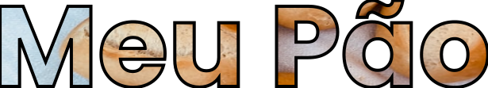

 

  

 
---

  📖 <strong>#Sobre</strong>

 
 

Esta landpage trás uma referencia a uma vitrine de padaria, e oque o pão representa para nós? 
Ele faz parte do seu café e do seu dia e para toda sua vida.

---

  🚀 <strong>#Tecnologias utilizadas</strong>

 

O projeto foi desenvolvido utilizando as seguintes tecnologias:

- React
- HTML
- CSS
- React-Icons

--- 

  ⌨ <strong>#Para acessar o projeto em produção.</strong>

 

Acessar o projeto diretamente clicando [aqui](https://app-meupaoreact.herokuapp.com/). 
Acesse também o prototipo no figma clicando [aqui](https://www.figma.com/file/En6cWVsEZVd6xWwGICMRU7/Untitled?node-id=0%3A1).

---
